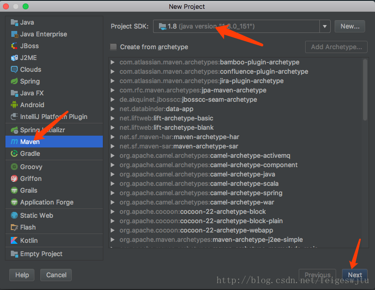
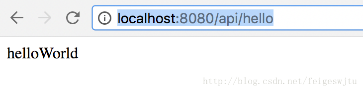
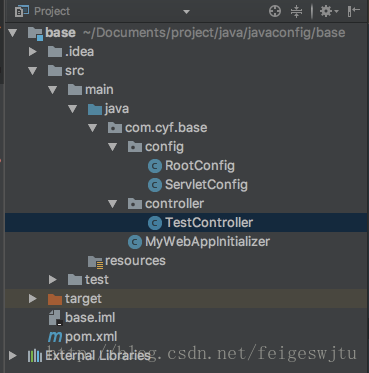

# 新建项目
现在一个普通的Maven项目，不要使用Archtype生成:


填写自己的GroupId和ArtifactId，一路Next。
# 修改pom.xml
新生成的pom.xml，只有项目的groupId和artifactId:
```xml
   <groupId>com.cyf</groupId>
    <artifactId>base</artifactId>
    <version>1.0-SNAPSHOT</version>
```
## 增加依赖包
```xml
    <dependencies>
        <dependency>
            <groupId>org.springframework</groupId>
            <artifactId>spring-webmvc</artifactId>
            <version>4.3.13.RELEASE</version>
        </dependency>
        <dependency>
            <groupId>javax.servlet</groupId>
            <artifactId>javax.servlet-api</artifactId>
            <version>3.1.0</version>
        </dependency>
    </dependencies>
```
其中spring-webmvc就是我们要用的核心包，我们使用Spring4系列中最新的一个版本。
javax.servlet-api是基础包，servlet的很多依赖都在这个包里，需要引入，我们使用了3.1.0。
如果要使用其他版本的，请到[maven库](http://mvnrepository.com/)中搜索。
## 增加编译插件
```xml
    <build>
        <plugins>
            <plugin>
                <groupId>org.apache.maven.plugins</groupId>
                <artifactId>maven-compiler-plugin</artifactId>
                <configuration>
                    <source>1.8</source>
                    <target>1.8</target>
                </configuration>
            </plugin>
        </plugins>
    </build>
```
## 增加packaging
一定要增加打包类型
```xml
    <packaging>war</packaging>
```
由于我没有增加打包类型为: war导致配置tomcat时无法找到Artifact，在网上找了很多解决方案都不行，加了这个配置就好。
# 增加WebAppInitializer
新建我们自己的package，然后增加类: MyWebAppInitializer
```java
public class MyWebAppInitializer extends AbstractAnnotationConfigDispatcherServletInitializer {
    //Spring 上下文配置
    @Override
    protected Class<?>[] getRootConfigClasses() {
        return new Class[]{RootConfig.class};
    }

    //Servlet上下文配置
    @Override
    protected Class<?>[] getServletConfigClasses() {
        return new Class[]{ServletConfig.class};
    }

    //mapping配置
    @Override
    protected String[] getServletMappings() {
        return new String[]{"/"};
    }
}
```
# 增加配置类
## Spring上下文配置类
```java
@Configuration
@EnableWebMvc
@ComponentScan(basePackages = "com.cyf.base")
public class RootConfig {
}
```
**@Configuration:** 
这是一个空类，只有一些注解其中，@Configuration标注这个类是配置类，后续我们会在这个类中添加一些Bean。
**@EnableWebMvc:** 
启用WebMvc。
@ComponentScan(basePackages = "com.cyf.base") 
自动扫描com.cyf.base下的所有类。

注意，@EnableWebMvc和@ComponentScan(basePackages = "com.cyf.base") 一定要放在一起，否则会有问题，项目能启动，但是拦截不到请求。

## Servlet上下文配置类
```java
@Configuration
public class ServletConfig extends WebMvcConfigurerAdapter {
}
```
这里的配置是继承了WebMvcConfigurerAdapter，它有很多默认的配置，不需要我们实现，当然我们可以覆盖它的默认实现，这里就不说了，后续有需要，我们再慢慢覆盖。

## 增加一个Controller
```java
@RestController
@RequestMapping("/api")
public class TestController {
    @GetMapping("/hello")
    public Object hello(){
        return "helloWorld";
    }
}
```
不用详细说了，稍微开发过SpringMvc的都清楚。

## 部署
这里直接在Idea部署到了tomcat上，这里就不重复造轮子了，到网上随便找找有很多，比如[Idea部署tomcat](https://www.cnblogs.com/tufujie/p/5738250.html)。

## 运行
运行后，浏览器中输入: 
http://localhost:8080/api/hello



到此为止，一个最最简单的基于JavaConfig配置的SpringMVC就出来了，是不是很简单。
最后附上项目结构图:

