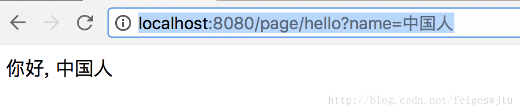

[上一篇文章](./messageConverter.md)，我们讲解了添加消息转换器的过程，消息转换器只有在@ResponseBody注解下才能生效，也就是我们说的Rest接口，那么渲染页面怎么配置呢？
一般情况下，SpringMVC肯定少不了Views层，主流的Views框架有FreeMarker, Velocity, Tiles, Groovy Markup 和JSP，而我比较喜欢FreeMarker，因为它的语法和Rails很像（笔者是从Rails转型的），当然FreeMarker也是最流行的Views框架之一。

本文介绍一下零XML配置 SpringMVC 项目中怎么引入FreeMarker模板引擎。

## 引入依赖包
SpringMVC对三方模板引擎的支持是在spring-context-support包中，另外也需要引入freemarker自身的包。
pom.xml
```xml
        <dependency>
            <groupId>org.springframework</groupId>
            <artifactId>spring-context-support</artifactId>
            <version>4.3.13.RELEASE</version>
        </dependency>
        <dependency>
            <groupId>org.freemarker</groupId>
            <artifactId>freemarker</artifactId>
            <version>2.3.23</version>
        </dependency>
```

# 配置FreeMarkerConfigurer
在RootConfig中配置FreeMarkerConfigurer的Bean:
RootConfig: 
```java
    @Bean
    public FreeMarkerConfigurer freeMarkerConfigurer() {
        FreeMarkerConfigurer configurer = new FreeMarkerConfigurer();
        configurer.setDefaultEncoding("utf-8");
        configurer.setTemplateLoaderPath("/WEB-INF/views/");
        Properties properties = new Properties();
        properties.setProperty("defaultEncoding", "UTF-8");
        configurer.setFreemarkerSettings(properties);
        return configurer;
    }
```

# 配置FreeMarkerViewResolver
默认的FreeMarkerConfigurer功能很少，也不够我们使用，所以SpringMVC专门提供了FreeMarkerViewResolver这个供我们附加自己的个性化配置。
RootConfig: 
```java

    @Bean
    public FreeMarkerViewResolver freeMarkerViewResolver() {
        FreeMarkerViewResolver resolver = new FreeMarkerViewResolver();
        resolver.setSuffix(".ftl");
        resolver.setContentType("text/html;charset=UTF-8");
        resolver.setCache(false);
        resolver.setExposeRequestAttributes(true);
        resolver.setRequestContextAttribute("request");
        resolver.setOrder(0);
        return resolver;
    }
```
# 新增一个页面
## 新增一个Controller
```java
@Controller
@RequestMapping("/page")
public class PageTestController {
    @GetMapping("/hello")
    public String hello(String name, Model model){
        System.out.println(name);
        model.addAttribute("name", name);
        return "app";
    }
}
```
## 新增页面
在main目录下新增webapp/WEB-INF/views目录，并且在目录下新增以下代码:
```html
<!DOCTYPE html PUBLIC "-//W3C//DTD HTML 4.01 Transitional//EN" "http://www.w3.org/TR/html4/loose.dtd">
<html>
<head>
    <meta http-equiv="Content-Type" content="text/html; charset=utf-8" />
    <title>HelloWorld</title>
</head>
<body>
你好, ${name}
</body>
</html>
```
## 结果
浏览器中输入:
```url
http://localhost:8080/page/hello?name=中国人
```
页面:


# 注意事项
一定要注意中文编码问题，添加下面一行，使用UTF-8可以解决中文编码问题，但是也要注意views的文件的编码。
```java
    @Bean
    public FreeMarkerConfigurer freeMarkerConfigurer() {
        FreeMarkerConfigurer configurer = new FreeMarkerConfigurer();
        //解决中文编码问题
        configurer.setDefaultEncoding("utf-8");
        configurer.setTemplateLoaderPath("/WEB-INF/views/");
        Properties properties = new Properties();
        configurer.setFreemarkerSettings(properties);
        return configurer;
    }
```
另外ServletConfig一定一定一定不要重载WebMvcConfigurerAdapter的下面的方法:
```java
    @Override
    public void configureViewResolvers(ViewResolverRegistry registry) {
    }
```
重载这个方法会导致我们自己实现的FreeMarkerViewResolver不生效，会生效默认的FreeMarkerViewResolver。

而Spring的官方指导文档却是重载了这个方法，导致我查这个问题查了将近两个小时，最后Debug跟踪源码才找到原因。
