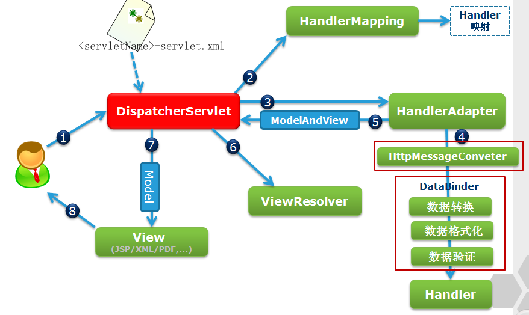

# 为什么要使用SpringMVC？
很多应用程序的问题在于处理业务数据和显示业务数据的视图的对象之间存在紧密耦合。通常，更新业务对象的命令都是从视图本身发起的，使视图对任何业务对象更改都有高度敏感性。而且，当多个视图依赖于同一个业务对象时是没有灵活性的。

Spring Web MVC是一种基于Java的实现了Web MVC设计模式的请求驱动类型的轻量级Web框架，即使用了MVC架构模式的思想，将web层进行职责解耦，基于请求驱动指的就是使用请求-响应模型，框架的目的就是帮助我们简化开发，Spring Web MVC也是要简化我们日常Web开发的。

# MVC设计模型
MVC 是一种著名的设计模式，特别是在 Web 应用程序领域。模式全都是关于将包含业务数据的模块与显示模块的视图解耦的。这是怎样发生的？视图（例如，JSP 页面）怎样能够与其模型（例如，包含数据的 JavaBean）解耦？记得这句格言么？一个层次的重定向几乎可以解决计算机业中的所有问题。确实，在模型和视图之间引入重定向层可以解决问题。此重定向层是控制器。控制器将接收请求，执行更新模型的操作，然后通知视图关于模型更改的消息。依赖于模型的状态并且依赖于请求的控制器可以决定要显示哪个视图。

# SpringMVC的强大之处
1. Spring MVC 实现了即用的 MVC 的核心概念。它为控制器和处理程序提供了大量与此模式相关的功能。并且当向 MVC 添加反转控制（Inversion of Control，IoC）时，它使应用程序高度解耦，提供了通过简单的配置更改即可动态更改组件的灵活性。Spring MVC 为您提供了完全控制应用程序的各个方面的力量。
2. Spring 的 Web MVC 模块是围绕 DispatcherServlet 而设计的。DispatcherServlet 给处理程序分派请求，执行视图解析，并且处理语言环境和主题解析，此外还为上传文件提供支持。
3. DispatcherServlet 通过使用处理程序映射来决定哪一个处理程序应当处理传入的请求。处理程序映射只是用于标识使用哪一个处理程序来处理特定 URL 模式的映射。处理程序是只有一种方法 ModelAndView handleRequest(request,response) 的控制器接口的实现。Spring 还有一些可用的高级处理程序实现；其中一个重要的高级处理程序实现是 SimpleFormController，它提供了将命令对象绑定到表单、对其执行验证等功能。
4. 您已经在本系列教程的先前教程中使用了 DispatcherServlet 和简单的处理程序。在下一个部分中，将使用 SimpleFormController 并说明 Spring MVC 提供的各种即用功能。

# SpringMVC优势

1. 清晰的角色划分：前端控制器（DispatcherServlet）、请求到处理器映射（HandlerMapping）、处理器适配器（HandlerAdapter）、视图解析器（ViewResolver）、处理器或页面控制器（Controller）、验证器（ Validator）、命令对象（Command  请求参数绑定到的对象就叫命令对象）、表单对象（Form Object 提供给表单展示和提交到的对象就叫表单对象）。
2. 分工明确，而且扩展点相当灵活，可以很容易扩展，虽然几乎不需要；
3. 由于命令对象就是一个POJO，无需继承框架特定API，可以使用命令对象直接作为业务对象；
4. 和Spring 其他框架无缝集成，是其它Web框架所不具备的；
5. 可适配，通过HandlerAdapter可以支持任意的类作为处理器；
6. 可定制性，HandlerMapping、ViewResolver等能够非常简单的定制；
7. 功能强大的数据验证、格式化、绑定机制；
8. 利用Spring提供的Mock对象能够非常简单的进行Web层单元测试；
9. 本地化、主题的解析的支持，使我们更容易进行国际化和主题的切换。
10. 强大的JSP标签库，使JSP编写更容易。
....... 还有比如RESTful风格的支持、简单的文件上传、约定大于配置的契约式编程支持、基于注解的零配置支持等等。

# SpringMVC流程图
下图是SpringMVC的流程图:

过程解释如下:
Spring工作流程描述
1. 用户向服务器发送请求，请求被Spring 前端控制Servelt DispatcherServlet捕获；
2. DispatcherServlet对请求URL进行解析，得到请求资源标识符（URI）。然后根据该URI，调用HandlerMapping获得该Handler配置的所有相关的对象（包括Handler对象以及Handler对象对应的拦截器），最后以HandlerExecutionChain对象的形式返回；
3. DispatcherServlet 根据获得的Handler，选择一个合适的HandlerAdapter。（附注：如果成功获得HandlerAdapter后，此时将开始执行拦截器的preHandler(…)方法）
4. 提取Request中的模型数据，填充Handler入参，开始执行Handler（Controller)。 在填充Handler的入参过程中，根据你的配置，Spring将帮你做一些额外的工作：
    * HttpMessageConveter： 将请求消息（如Json、xml等数据）转换成一个对象，将对象转换为指定的响应信息
    * 数据转换：对请求消息进行数据转换。如String转换成Integer、Double等
    * 数据根式化：对请求消息进行数据格式化。 如将字符串转换成格式化数字或格式化日期等
    * 数据验证： 验证数据的有效性（长度、格式等），验证结果存储到BindingResult或Error中
5. Handler执行完成后，向DispatcherServlet 返回一个ModelAndView对象；
6. 根据返回的ModelAndView，选择一个适合的ViewResolver（必须是已经注册到Spring容器中的ViewResolver)返回给DispatcherServlet ；
7. ViewResolver 结合Model和View，来渲染视图
8. 将渲染结果返回给客户端。

