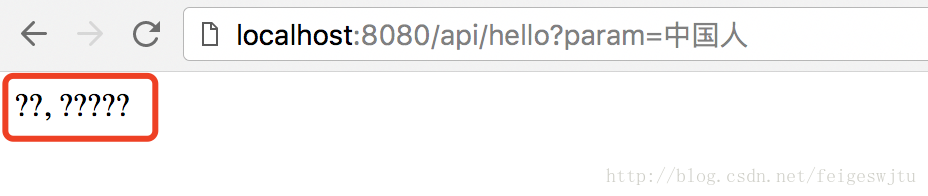
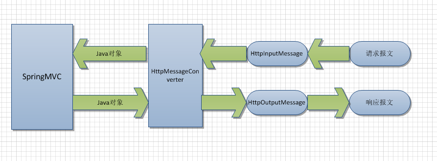

[上一篇文章](./base.md)我们搭建好了基础环境，写了一个简单的controller。
使用RestController写一个简单的接口，返回了一串"helloWorld"字符串，现在我们改下controller的内容:
```java
@RestController
@RequestMapping("/api")
public class TestController {
    @GetMapping("/hello")
    public Object hello(String name){
        System.out.println(name);
        return "你好, " + name;
    }
}
```
浏览器中输入:
```url
http://localhost:8080/api/hello?name=中国人
```
控制台打印了:
```data
中国人
```
然而，浏览器返回的却是:

估计是因为SpringMVC是老外写的吧，不支持中文。
# 消息转换器
在SpringMVC里有一个消息转换器(MessageConverter)的概念，顾名思义就是对输入输出值进行转换。


在抽象类WebMvcConfigurerAdapter中有一个可以重写的方法，可以配置我们自己的消息转换器。
```java
@Override
    public void configureMessageConverters(List<HttpMessageConverter<?>> converters) {
    }
```
当然，SpringMVC里有自己的消息转换器，我们跟踪configureMessageConverters就能找到。

configureMessageConverters方法在WebMvcConfigurationSupport类中被调用:
```java
    protected final List<HttpMessageConverter<?>> getMessageConverters() {
        if (this.messageConverters == null) {
             //如果消息转换器列表为null，初始化
            this.messageConverters = new ArrayList<HttpMessageConverter<?>>();
            //配置我们自己的消息转换器
            configureMessageConverters(this.messageConverters);
            //如果我们自己没有配置，配置默认的消息转换器
            if (this.messageConverters.isEmpty()) {
                addDefaultHttpMessageConverters(this.messageConverters);
            }
            // 追加其他配置
            extendMessageConverters(this.messageConverters);
        }
        return this.messageConverters;
    }

```

有人就要问了，可以自定义消息转换器，为什么还要extendMessageConverters呢？官方文档上是这样说的，这个方法多用于如果使用了默认的消息转换器配置，又需要自定义我们的消息转换器，不由得感慨，Spring的贡献者真是想得周到。

SpringMVC默认的消息转换器配置的源码如下:
```java
    protected final void addDefaultHttpMessageConverters(List<HttpMessageConverter<?>> messageConverters) {
        StringHttpMessageConverter stringConverter = new StringHttpMessageConverter();
        stringConverter.setWriteAcceptCharset(false);

        messageConverters.add(new ByteArrayHttpMessageConverter());
        messageConverters.add(stringConverter);
        messageConverters.add(new ResourceHttpMessageConverter());
        messageConverters.add(new SourceHttpMessageConverter<Source>());
        messageConverters.add(new AllEncompassingFormHttpMessageConverter());

        if (romePresent) {
            messageConverters.add(new AtomFeedHttpMessageConverter());
            messageConverters.add(new RssChannelHttpMessageConverter());
        }

        if (jackson2XmlPresent) {
            messageConverters.add(new MappingJackson2XmlHttpMessageConverter(
                    Jackson2ObjectMapperBuilder.xml().applicationContext(this.applicationContext).build()));
        }
        else if (jaxb2Present) {
            messageConverters.add(new Jaxb2RootElementHttpMessageConverter());
        }

        if (jackson2Present) {
            messageConverters.add(new MappingJackson2HttpMessageConverter(
                    Jackson2ObjectMapperBuilder.json().applicationContext(this.applicationContext).build()));
        }
        else if (gsonPresent) {
            messageConverters.add(new GsonHttpMessageConverter());
        }
    }
```
# 自定义消息转换器
## 字符串消息转换器
回到我们的问题。接口返回的值是乱码，原因肯定是因为默认消息转换器不支持中文，需要我们自定义自定义消息转换器。
如果要自定义JSON消息转换器，需要引入新的包，在pom.xml引入:
```xml
<dependency>
    <groupId>com.fasterxml.jackson.datatype</groupId>
    <artifactId>jackson-datatype-jsr310</artifactId>
    <version>2.9.0</version>
</dependency>
```
在ServletConfig重写configureMessageConverters()方法:
```java
    @Override
    public void configureMessageConverters(List<HttpMessageConverter<?>> converters) {
        StringHttpMessageConverter converter = new StringHttpMessageConverter();
        Charset urf8 = Charset.forName("UTF-8");
        //设置字符串转换器的MediaType
        converter.setSupportedMediaTypes(Collections.singletonList(new MediaType("text", "plain", urf8)));
        //设置字符串转换器的编码
        converter.setDefaultCharset(urf8);
        converters.add(converter);
    }
```
重启项目后重新请求，返回就没有问题了。

## JSON消息转换器
我们的例子演示了字符串消息转换器的使用，那么如果返回的是JSON格式的数据呢，肯定需要一个JSON消息转换器。
我们在RootConfig中定义一个Bean:
```java
    @Bean
    public ObjectMapper objectMapper() {
        String datetimeFormat = "yyyy-MM-dd HH:mm:ss";
        JavaTimeModule javaTimeModule = new JavaTimeModule();
        javaTimeModule.addDeserializer(LocalDateTime.class,
                new LocalDateTimeDeserializer(DateTimeFormatter.ofPattern(datetimeFormat)));
        javaTimeModule.addSerializer(LocalDateTime.class,
                new LocalDateTimeSerializer(DateTimeFormatter.ofPattern(datetimeFormat)));
        return Jackson2ObjectMapperBuilder
                .json()
                .modules(javaTimeModule)
                .featuresToDisable(WRITE_DATES_AS_TIMESTAMPS)
                .dateFormat(new SimpleDateFormat(datetimeFormat)) // Date对象
                .build();
    }
```
消息转换链表中加入JSON消息转换器:
```java
    //注入Object解析器
    @Autowired
    private ObjectMapper objectMapper;

    @Override
    public void configureMessageConverters(List<HttpMessageConverter<?>> converters) {
        StringHttpMessageConverter converter = new StringHttpMessageConverter();
        Charset urf8 = Charset.forName("UTF-8");
        converter.setSupportedMediaTypes(Collections.singletonList(new MediaType("text", "plain", urf8)));
        converter.setDefaultCharset(urf8);
        //添加字符串消息转换器
        converters.add(converter);
        MappingJackson2HttpMessageConverter jsonConverter = new MappingJackson2HttpMessageConverter();
        jsonConverter.setDefaultCharset(urf8);
        jsonConverter.setObjectMapper(objectMapper);
        //添加JSON消息转换器
        converters.add(jsonConverter);
    }
```

## 其他转换器
还有很多其他消息转换器，比如XML消息转换器等等，由于我们用的比较少，这里就不介绍了，感兴趣的可以参考SpringMVC的[官方文档](https://docs.spring.io/spring/docs/current/spring-framework-reference/web.html#mvc-config-message-converters)。
